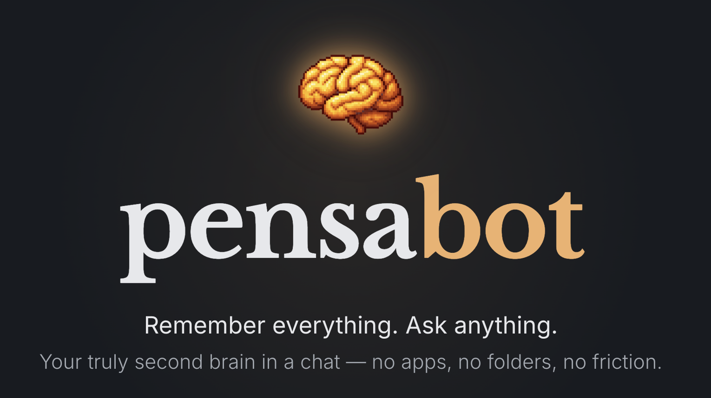

# PensaBot - Your second brain. Just a chat with AI.

<p align="center">
  
</p>

<p align="center">
  <a href="https://discord.gg/5DFNca7sp2"></a>
</p>

<p align="center">
  <a href="https://pensabot.ai">Website</a> · <a href="https://discord.gg/5DFNca7sp2">Discord Community</a>
</p>

PensaBot is an AI chat that integrates with Telegram (Whatsapp or other providers coming soon) and works as your personal memory. 

Send it anything — text, voice notes, photos, links, and it will remember everything for you. When you need something back, just ask in plain language. 

It's fully self-hostable, so your data stays yours.

## Why PensaBot

I built PensaBot because I was tired of note-taking apps. I tried all of them and I always ended up abandoning them after a few weeks. The problem was never the app itself, it was the friction: deciding where to put things, organizing folders and tags... I never kept up with it.

What I actually do every day is chat. So I thought — what if I could just send things to a chat and have it remember for me? That's PensaBot. 

No structure, no organization, no overhead. You just talk to it, and when you need something back, you ask. It feels like texting a friend who has perfect memory.

## Features

- 💬 Captures text, voice, images, and URLs from Telegram
- 🎙️ Transcribes voice messages and describes images automatically
- 🔗 Scrapes and summarizes links so you don't have to
- 📦 Batches short back-to-back messages so context is preserved
- 🔍 Hybrid retrieval with vector embeddings + BM25 keyword search
- 🔒 Self-hosted — your data stays on your infrastructure

### Roadmap

PensaBot is in early development. This is just a small part of our vision:

- **WhatsApp support** — use PensaBot from WhatsApp, not just Telegram
- **Local models** — run with Ollama or OpenRouter instead of OpenAI, so you can go fully local

## Quick Start

> Need help or want to chat? Join our [Discord community](https://discord.gg/5DFNca7sp2) — we're happy to help you get started.

You'll need [Docker](https://docs.docker.com/get-docker/), an [OpenAI API key](https://platform.openai.com/api-keys), and a Telegram bot token from [@BotFather](https://t.me/BotFather).

```bash
git clone https://github.com/albersola/pensabot.git ~/pensabot
cd ~/pensabot
```

Create a `.env` file and fill in the required values:

| Variable | What it is | Where to get it |
|----------|-----------|-----------------|
| `TELEGRAM_BOT_TOKEN` | Token for your Telegram bot | Create a bot with [@BotFather](https://t.me/BotFather) and copy the token |
| `TELEGRAM_BOT_USERNAME` | Your bot's username (without @) | The username you chose when creating the bot |
| `OPENAI_API_KEY` | API key for OpenAI | [platform.openai.com/api-keys](https://platform.openai.com/api-keys) |
| `POSTGRES_PASSWORD` | Database password | Generate one: `openssl rand -hex 32` |
| `SECRET_KEY` | App secret for sessions | Generate one: `openssl rand -hex 32` |
| `BASE_URL` | Public URL of your instance | `http://localhost:8000` for local, or your domain |
| `MEDIA_DIR` | Where media files are stored | Leave as `/app/media` for Docker |

Start the full stack:

```bash
docker compose -f docker-compose.server.yml up -d --build
```

Open `http://localhost:8000`, register a user, go to `/dashboard`, and link your Telegram account.

## Architecture

```text
Telegram / WhatsApp (coming soon)
        |
        v
   message table
        |
        +--> preprocess_message
        |      |- voice -> Whisper transcription
        |      |- image -> vision description
        |      `- URL -> scrape + summary
        |
        `--> process_message
               |- batch nearby pending messages
               |- wait briefly for continuations
               |- ask for clarification when needed
               `- route to save_memory or search_memory
                             |
                             v
                  memory table + embedding vector
                             |
                             +--> vector similarity
                             `--> ParadeDB BM25
                                      |
                                      v
                               synthesized reply
                                      |
                                      v
                              sent back to chat
```

## Local Development

Prerequisites: Python 3.12+, [uv](https://docs.astral.sh/uv/), Docker

The host-run app reads `.env` by default. Run `cp .env.local .env` and fill
the necessary variables.


Install and run:

```bash
git clone https://github.com/albersola/pensabot.git
cd pensabot
uv sync
docker compose up -d
make migrate
make run
```

Start the worker in a second terminal:

```bash
make worker
```

## Contributing

Open an issue or pull request if you want to improve the project.

Questions or ideas: [GitHub Issues](https://github.com/albersola/pensabot/issues) · [Discord](https://discord.gg/5DFNca7sp2)

## License

AGPL-3.0
